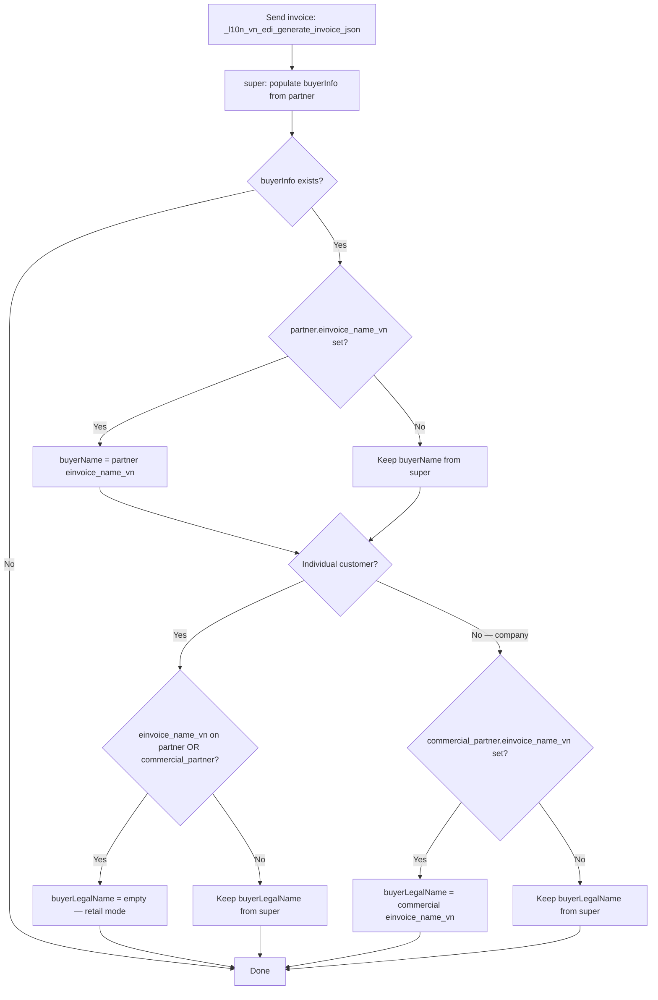
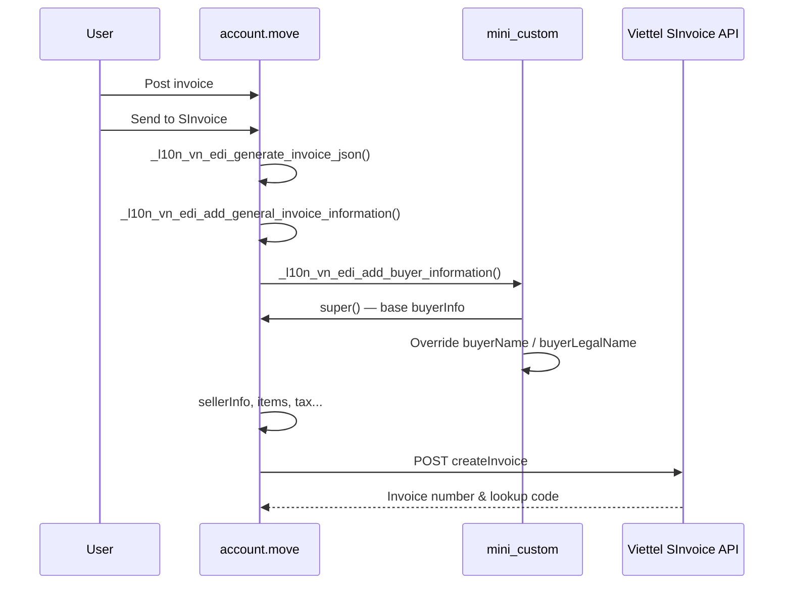

# VN SInvoice — Mini Custom

A lightweight customization on top of Odoo's **Viettel SInvoice** integration (`l10n_vn_edi_viettel`) for **Odoo 18**. It controls how **buyer names** are sent to Viettel when issuing e-invoices.

## Overview

When an invoice is submitted to Viettel SInvoice, the API expects buyer details in a `buyerInfo` block. Two name fields are especially important:

| API field | Typical meaning |
|---|---|
| `buyerName` | Buyer / contact name printed on the invoice |
| `buyerLegalName` | Legal / company name (tax registration name) |

The standard Odoo module always maps:

- `buyerName` ← contact name (`partner_id.name`)
- `buyerLegalName` ← commercial partner name (`commercial_partner_id.name`)

This causes two common issues:

1. **Retail / individual customers** — the invoice may show both a contact name and a legal name, even when only one line is needed.
2. **Name mismatch** — the name stored in Odoo may differ from the legal name on the tax registration or the name required on the e-invoice.

This module adds a custom field **`einvoice_name_vn`** on contacts and adjusts `buyerInfo` before the invoice JSON is sent to Viettel.

## Dependencies

```
l10n_vn_edi_viettel          (Odoo standard Viettel SInvoice module)
        │
        └── l10n_vn_edi_viettel_mini_custom   (this module)
```

## What this module adds

### New field on contacts

- **Field:** `einvoice_name_vn` — *E-Invoice Name (VN)*
- **Location on the contact form:**
  - **Accounting** tab
  - Also shown next to the default SInvoice symbol (hidden for company records)

If the field was previously stored as `custom_legal_name`, Odoo migrates it automatically via `oldname`.

### Override of buyer information

The module extends `_l10n_vn_edi_add_buyer_information()` on `account.move`. It runs **after** the standard Odoo logic and only changes `buyerName` and/or `buyerLegalName`.

Processing flow when building the JSON payload:

```
_l10n_vn_edi_generate_invoice_json()
    └── _l10n_vn_edi_add_buyer_information(json_values)
            ├── super()  → standard Odoo logic (buyerName, buyerLegalName, tax ID, address...)
            └── custom   → adjust buyerName / buyerLegalName from einvoice_name_vn
```

## Detailed logic



### How "individual" is detected

```python
is_individual = (
    commercial_partner.company_type == "person"
    or not commercial_partner.is_company
)
```

## Business rules (plain language)

### Step 1 — `buyerName`

If the invoice contact has **E-Invoice Name (VN)** filled in:

→ use that value as `buyerName`

Otherwise:

→ keep the standard Odoo value (contact name)

### Step 2 — `buyerLegalName`

#### Individual customer (person / not a company)

If **either** the contact **or** the commercial partner has **E-Invoice Name (VN)** filled in:

→ `buyerLegalName` is left **blank** (retail mode — one name line only)

If neither has the field filled in:

→ standard Odoo behavior is kept unchanged

#### Company customer

If the **commercial partner** has **E-Invoice Name (VN)** filled in:

→ use that value as `buyerLegalName`

Otherwise:

→ keep the standard Odoo value (commercial partner name)

### Backward compatibility

If **no one** fills in **E-Invoice Name (VN)**, this module does **nothing**. Behavior is identical to the standard `l10n_vn_edi_viettel` module.

## Quick reference table

| Scenario | `buyerName` | `buyerLegalName` |
|---|---|---|
| No custom name configured | Standard Odoo | Standard Odoo |
| Individual + custom name on contact or company | Custom (if on contact) | **Empty** |
| Company + custom name on commercial partner | Custom (if on contact) | Custom commercial name |
| Company, no custom name | Standard Odoo | Standard Odoo |

## Examples

### Retail customer

| Odoo contact | E-Invoice Name (VN) | Result on e-invoice |
|---|---|---|
| Nguyen Van A (individual) | `Nguyen Van A` | buyerName: Nguyen Van A, buyerLegalName: *(empty)* |

### B2B — legal name differs from contact name

| Odoo | E-Invoice Name (VN) on company | Result |
|---|---|---|
| Contact: Mr. B — Company: XYZ Co., Ltd | `CONG TY TNHH XYZ` | buyerLegalName: CONG TY TNHH XYZ |

### No customization

| Odoo | E-Invoice Name (VN) | Result |
|---|---|---|
| Any contact / company | *(empty)* | Same as standard Odoo Viettel module |

## Installation & usage

1. Install **`l10n_vn_edi_viettel`** and configure Viettel SInvoice credentials on the company.
2. Install **`l10n_vn_edi_viettel_mini_custom`**.
3. Open **Contacts**, select a customer, go to the **Accounting** tab.
4. Fill in **E-Invoice Name (VN)** when the printed e-invoice name should differ from the Odoo name.
5. Post and send the invoice as usual — buyer names are adjusted automatically in the JSON payload.

## What this module does **not** do

- Does not connect to Viettel API on its own
- Does not handle login, cancellation, payment status, PDF/XML download
- Does not add cron jobs or wizards

All of the above remain in the standard **`l10n_vn_edi_viettel`** module.

## EDI flow (overall)



Everything else (token, cancellation, payment status, PDF/XML download) is handled by the standard **`l10n_vn_edi_viettel`** module, not this one.

## Module structure

```
l10n_vn_edi_viettel_mini_custom/
├── __manifest__.py
├── models/
│   ├── res_partner.py       # einvoice_name_vn field
│   └── account_move.py      # buyerInfo override
└── views/
    └── res_partner_views.xml
```

## Notes for support / customer replies

**Q: Why does my retail invoice still show two names?**  
A: Fill in **E-Invoice Name (VN)** on the customer contact. For individuals, the module clears the legal name only when this field is used.

**Q: How do I change the company name on the e-invoice?**  
A: Set **E-Invoice Name (VN)** on the **commercial partner** (the company record), not only on the contact person.

**Q: Will this break existing invoices?**  
A: No. If the field is empty, behavior is unchanged from the standard Odoo Viettel module.

**Q: Is the field company-specific?**  
A: No. `einvoice_name_vn` is shared across companies in the same database.

## Version

- Odoo: **18.0**
- Module: **18.0.1.0.0**
