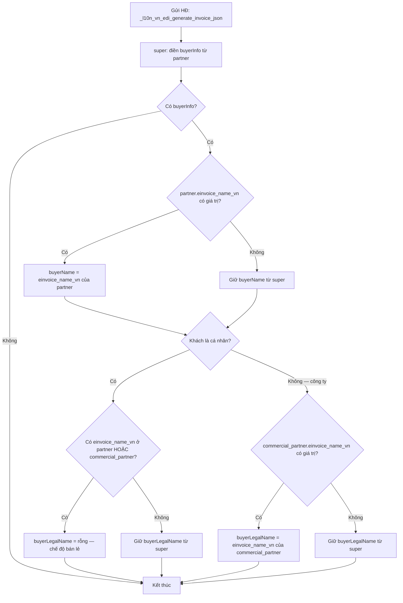
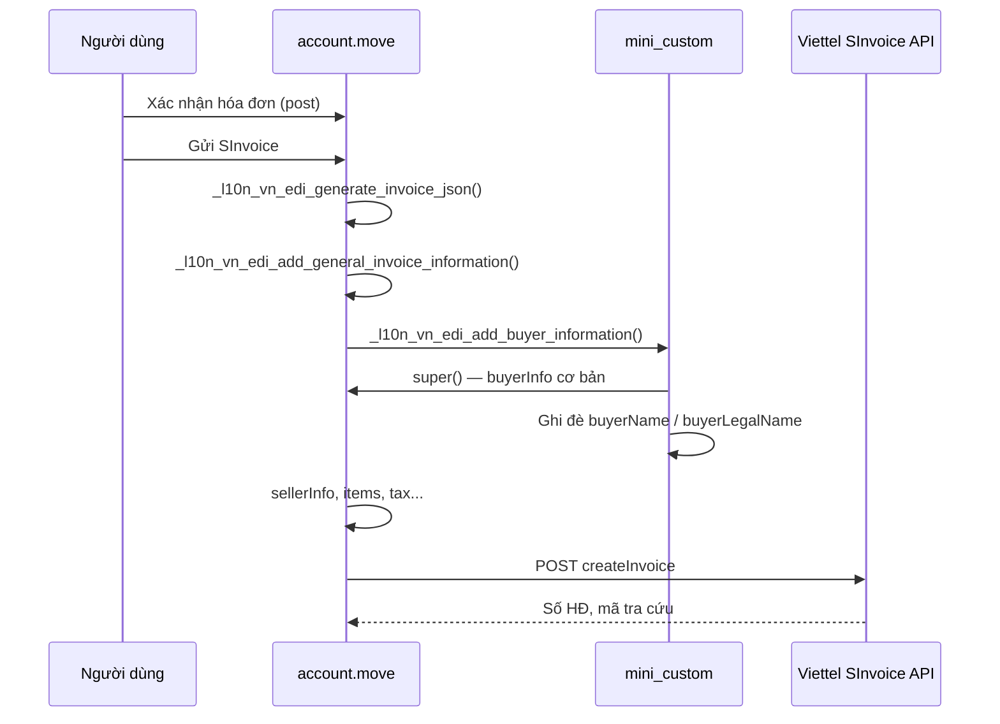

# l10n_vn_edi_viettel_mini_custom

Module tùy biến nhỏ trên nền **Viettel SInvoice** (`l10n_vn_edi_viettel`) của Odoo 18, tập trung vào **tên người mua** gửi lên hệ thống hóa đơn điện tử Viettel.

> English version: [README.en.md](README.en.md)

## Mục đích

Khi phát hành hóa đơn điện tử, Viettel SInvoice yêu cầu hai trường tên trong `buyerInfo`:

| Trường API | Ý nghĩa thường gặp |
|---|---|
| `buyerName` | Tên người mua / người liên hệ trên hóa đơn |
| `buyerLegalName` | Tên pháp lý / tên công ty (MST) |

Module gốc Odoo luôn map:

- `buyerName` ← `partner_id.name`
- `buyerLegalName` ← `commercial_partner_id.name`

Điều này gây khó chịu trong các trường hợp:

1. **Khách lẻ (cá nhân)**: hóa đơn hiện cả tên liên hệ lẫn tên pháp lý trùng hoặc không cần thiết.
2. **Tên trên hóa đơn khác tên trong Odoo**: cần ghi tên tiếng Việt có dấu, tên thương mại, hoặc tên pháp lý chính xác theo MST.

Module custom này thêm trường **`einvoice_name_vn`** trên đối tác và ghi đè logic điền `buyerInfo` trước khi gọi API Viettel.

## Phụ thuộc

```
l10n_vn_edi_viettel  (module Odoo gốc — tích hợp Viettel SInvoice)
        │
        └── l10n_vn_edi_viettel_mini_custom  (module này)
```

## Thành phần

### 1. Trường mới trên `res.partner`

```python
einvoice_name_vn = fields.Char(string="E-Invoice Name (VN)")
```

- Trường cũ trong DB: `custom_legal_name` (Odoo tự migrate qua `oldname`).
- Hiển thị trên form đối tác:
  - Tab **Accounting** (trang `accounting_disabled`).
  - Ngay sau **Default Symbol** (`l10n_vn_edi_symbol`) — ẩn nếu là công ty (`invisible="is_company"`).

### 2. Ghi đè `_l10n_vn_edi_add_buyer_information`

File: `models/account_move.py`

Luồng xử lý khi tạo JSON gửi Viettel:

```
_l10n_vn_edi_generate_invoice_json()
    └── _l10n_vn_edi_add_buyer_information(json_values)
            ├── super()  → logic gốc Odoo (buyerName, buyerLegalName, MST, địa chỉ...)
            └── custom   → điều chỉnh buyerName / buyerLegalName theo einvoice_name_vn
```

## Logic chi tiết



### Cách xác định "cá nhân"

```python
is_individual = (
    commercial_partner.company_type == "person"
    or not commercial_partner.is_company
)
```

### Quy tắc ưu tiên

| Tình huống | `buyerName` | `buyerLegalName` |
|---|---|---|
| Không điền `einvoice_name_vn` | Như module gốc | Như module gốc |
| Partner có `einvoice_name_vn` | Giá trị trường này | Xem hàng dưới |
| Cá nhân + có `einvoice_name_vn` (partner hoặc commercial) | Giá trị custom (nếu có ở partner) | **Rỗng** |
| Công ty + commercial có `einvoice_name_vn` | Custom partner (nếu có) | Giá trị commercial |
| Công ty, không có custom | Như module gốc | Như module gốc |

> **Tương thích ngược:** Chỉ khi **có ít nhất một** `einvoice_name_vn` thì mới áp dụng hành vi "cá nhân → legal name rỗng". Nếu không điền trường này, module hoạt động y hệt bản gốc.

## Ví dụ thực tế

### Khách lẻ — siêu thị / bán lẻ

| Odoo | einvoice_name_vn | Kết quả trên HĐĐT |
|---|---|---|
| Nguyễn Văn A (person) | `Nguyễn Văn A` | buyerName: Nguyễn Văn A, buyerLegalName: *(trống)* |

### Công ty — tên pháp lý khác tên contact

| Odoo | einvoice_name_vn (commercial) | Kết quả |
|---|---|---|
| Contact: Mr. B — Công ty: CÔNG TY TNHH XYZ | `CÔNG TY TNHH XYZ` | buyerLegalName: CÔNG TY TNHH XYZ |

### Không dùng custom

| Odoo | einvoice_name_vn | Kết quả |
|---|---|---|
| Partner + Commercial partner | *(trống)* | Giống module `l10n_vn_edi_viettel` gốc |

## Cách cài đặt và sử dụng

1. Cài module **`l10n_vn_edi_viettel`** (cấu hình username/password Viettel trên công ty, ký hiệu hóa đơn...).
2. Cài module **`l10n_vn_edi_viettel_mini_custom`**.
3. Mở **Contacts** → chọn khách hàng → tab **Accounting** (hoặc khu vực SInvoice trên form).
4. Điền **E-Invoice Name (VN)** nếu cần tên khác trên hóa đơn điện tử.
5. Xác nhận và gửi hóa đơn như bình thường — JSON `buyerInfo` sẽ được module tự điều chỉnh trước khi gọi API.

## Vị trí trong luồng EDI tổng thể



Phần còn lại (token, hủy HĐ, cập nhật thanh toán, tải PDF/XML) **không thuộc** module này — nằm ở `l10n_vn_edi_viettel`.

## File trong module

```
l10n_vn_edi_viettel_mini_custom/
├── __manifest__.py          # metadata, depends l10n_vn_edi_viettel
├── models/
│   ├── res_partner.py       # trường einvoice_name_vn
│   └── account_move.py      # ghi đè buyerInfo
└── views/
    └── res_partner_views.xml # UI trường trên form đối tác
```

## Lưu ý kỹ thuật

- Module **không** thêm API, cron hay wizard — chỉ hook vào bước build JSON.
- Trường `einvoice_name_vn` **không** `company_dependent`; dùng chung trên mọi công ty trong DB.
- Với contact con của công ty, nên điền tên trên **commercial partner** nếu muốn đổi `buyerLegalName`.
- Kiểm tra kỹ trên môi trường Viettel **sandbox** trước khi production — quy định hiển thị tên người mua có thể thay đổi theo mẫu hóa đơn.

## Phiên bản

- Odoo: **18.0**
- Module version: **18.0.1.0.0**
